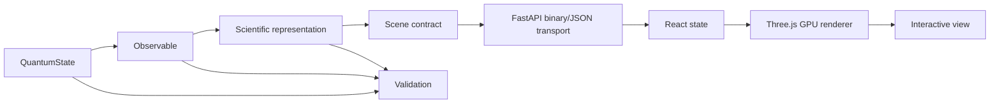

# 系统架构

!!! note "架构契约与完成状态是两回事"

    本页定义目标边界。当前仓库只有部分链路实现，真实完成度以[当前状态](../project/status.md)为准。

## 核心边界



Python 不生成最终像素。浏览器也不重新定义物理量。

### Python 负责

- 解析或数值量子态；
- $\psi$、$|\psi|^2$、相位、概率流；
- Monte Carlo/逆 CDF 采样；
- marching cubes 前的标量场；
- 归一化、节点和收敛验证；
- Scene metadata 与引用键。

### 浏览器目标职责

- Float32 buffer 上传 GPU；
- 点精灵、网格、流线和切片；
- 相机、面板、动画和截图；
- 相位色轮、透明度和后处理；
- 不改变物理数据的视觉映射。

## 单仓库而非 Python 内嵌前端框架

QuViz 采用 `src/quviz` 与 `web/` 并列的单仓库：

```text
QuViz/
├── src/quviz/       # scientific core + API
├── web/             # React + TypeScript + Three.js
├── docs/            # MkDocs
├── tests/           # physical and contract tests
└── references.bib   # citation source of truth
```

这比把复杂 3D 页面塞进 Jupyter widget、Dash 或 Streamlit 更利于：

- 自定义 shader；
- 大点云和二进制传输；
- 独立测试前端；
- 将来迁移 WebGPU；
- 形成可部署的产品界面。

## Scene Contract

场景资产必须携带：

- `state`: $n,\ell,m,Z,$ basis；
- `observable`: density、phase、current 等；
- `representation`: point cloud、isosurface 等；
- 坐标、单位和归一化；
- 截断概率或有限盒质量；
- 来源键与警告。

渲染器只消费语义完整的场景，而不拿无上下文数组自行猜测。当前点云通过 QVPC/1 与 metadata sidecar 同参数请求组合，等值面直接携带 metadata；Inspector 和图例均使用服务端返回值，不再重新计算标签、能量或引用。
