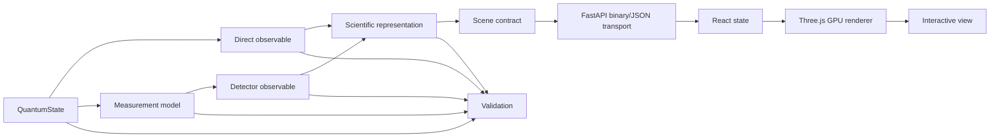

# 系统架构

!!! note "架构契约与完成状态是两回事"

    本页定义目标边界。当前仓库只有部分链路实现，真实完成度以[当前状态](../project/status.md)为准。

## 核心边界



直接计算的 observable 与经实验前向模型得到的 detector observable 是两条分支；它们都先进入 representation 和场景契约，最后才由浏览器生成像素。Python 不生成最终像素，浏览器也不重新定义物理量。Phase 0 实现的是直接 observable 分支，通用 `MeasurementModel` 仍是后续能力。

### Python 负责

- 解析或数值量子态；
- $\psi$、$|\psi|^2$、相位、概率流；
- Monte Carlo/逆 CDF 采样；
- marching cubes 前的标量场；
- 归一化、节点和收敛验证；
- Scene metadata 与引用键。

### 浏览器目标职责

- Float32 buffer 上传 GPU；
- 点精灵、网格、流线和切片；
- 相机、面板、动画和截图；
- 相位色轮、透明度和后处理；
- 不改变物理数据的视觉映射。

## 单仓库而非 Python 内嵌前端框架

QuViz 采用 `src/quviz` 与 `web/` 并列的单仓库：

```text
QuViz/
├── src/quviz/       # scientific core + API
├── web/             # React + TypeScript + Three.js
├── docs/            # MkDocs
├── tests/           # physical and contract tests
└── references.bib   # citation source of truth
```

这比把复杂 3D 页面塞进 Jupyter widget、Dash 或 Streamlit 更利于：

- 自定义 shader；
- 大点云和二进制传输；
- 独立测试前端；
- 将来迁移 WebGPU；
- 形成可部署的产品界面。

## Scene Contract

场景资产必须携带与其状态类型相符的身份：

- 本征态：$n,\ell,m,Z,a_\mu,$ basis；
- 叠加态：逐项 $(n,\ell,m)$、复系数、$Z,a_\mu,$ basis 与时刻；叠加态没有一个可冒充其整体身份的单一 $(n,\ell,m)$；
- `observable`: density、phase、current 等；
- `representation`: point cloud、isosurface 等；
- 坐标、单位、归一化、来源键与警告；
- 与 representation 对应的数值诊断，而不是一组假装通用的字段。

Phase 0 的公开诊断按资产区分：

| representation | 当前可核查诊断 |
|---|---|
| point cloud | QVPC 响应头中的有限径向域捕获质量与样本最大 extent |
| isosurface | 请求/实际超水平集质量、有限网格 $\int\rho\,dV$、网格分辨率、spacing 与 extent；叠加态另带有限盒/相位相关网格诊断 |
| streamlines | extent、播种密度下限、弧长步长、速度范围，以及带尺度类型和 probe 数的连续性残差；含时叠加另带 phase 审计数 |
| slice | 平面、observable、extent、spacing、值单位；相位切片另带低振幅 mask 的阈值、数值下限、占比和 `valid_mask` |

这些字段说明“计算覆盖了什么”和“用什么数值证据判断”，并不把有限网格结果升级为解析证明。

渲染器只消费语义完整的场景，而不拿无上下文数组自行猜测。当前点云通过 QVPC/1、响应头与同参数 metadata 请求组合，JSON 场景资产直接携带 metadata 和 representation 专属诊断；Inspector 和图例使用这些服务端返回值，不重新计算标签、能量或引用。
